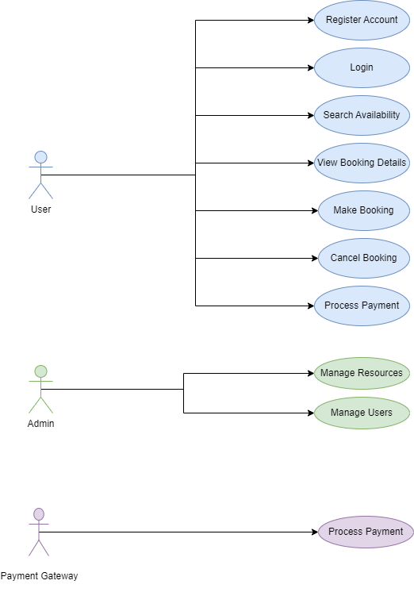

# Requirement Analysis in Software Development

## 📌 Introduction

Welcome to the **Requirement Analysis Project** – a key step in the Software Development Life Cycle (SDLC). This repository is dedicated to understanding and documenting the requirement analysis phase for a **Booking Management System**.

The goal is to simulate a real-world development scenario by analyzing, structuring, and presenting both functional and non-functional requirements. This includes use case diagrams, user stories, and clearly defined acceptance criteria. The project emphasizes **clarity**, **structure**, and **alignment with user needs**, laying the foundation for scalable and successful software development.

This repository contains all the artifacts and documentation created during the requirement analysis phase.
## 🔍 What is Requirement Analysis?

Requirement Analysis is a critical phase in the Software Development Life Cycle (SDLC) where the needs and expectations of users and stakeholders are gathered, analyzed, and documented. It serves as the foundation upon which the entire system is designed and developed.

During this phase, developers and analysts work together to understand what the software must do (functional requirements) and how it should perform (non-functional requirements). The goal is to transform vague ideas into clear, actionable, and measurable requirements.

This step helps identify project scope, avoid misunderstandings, prevent scope creep, and ensure the final product meets user needs. Effective requirement analysis leads to better project planning, cost estimation, risk mitigation, and ultimately, a successful software solution.

In essence, it sets the blueprint for building software that is both technically sound and aligned with user goals.
## ✅ Why is Requirement Analysis Important?

Requirement Analysis plays a vital role in the success of any software project. Here are three key reasons why it is essential in the Software Development Life Cycle (SDLC):

### 1. Prevents Miscommunication and Misalignment
By clearly documenting stakeholder needs and expectations, Requirement Analysis ensures everyone involved—from developers to clients—has a shared understanding of the project's goals and scope.

### 2. Improves Planning and Cost Estimation
A well-done requirement analysis helps teams estimate time, resources, and cost more accurately, reducing the chances of unexpected delays or budget overruns.

### 3. Reduces Rework and Enhances Quality
By identifying and clarifying requirements early, development teams avoid costly changes later. This leads to building the right product from the start and improves overall software quality.

---

Requirement Analysis helps bridge the gap between what users want and what developers build, setting the stage for project success.
## 🧩 Key Activities in Requirement Analysis

Requirement Analysis involves several structured activities that ensure all stakeholder needs are captured, clarified, and validated for effective development. Below are the five key activities:

- **Requirement Gathering**
  - This is the initial step where information is collected from stakeholders through interviews, surveys, questionnaires, and observation.
  - The goal is to understand what the users want and need from the system.

- **Requirement Elicitation**
  - This step involves refining and exploring the collected data.
  - Techniques such as brainstorming, prototyping, and workshops are used to uncover implicit and explicit requirements.

- **Requirement Documentation**
  - All gathered and elicited requirements are documented clearly in formats like Software Requirement Specifications (SRS) or user stories.
  - Proper documentation ensures clarity, consistency, and traceability.

- **Requirement Analysis and Modeling**
  - In this step, requirements are analyzed for feasibility, completeness, and consistency.
  - Modeling tools like use case diagrams, data flow diagrams (DFDs), or UML are often used to visualize the system.

- **Requirement Validation**
  - This final step ensures that the documented requirements truly represent the stakeholders’ needs.
  - It often involves reviews, walkthroughs, and stakeholder approval sessions.

These activities collectively form a strong foundation for building software that meets user expectations and business goals.
## 📌 Types of Requirements

In software development, requirements are generally divided into two major categories: Functional and Non-functional Requirements. Both are crucial to building a system that works correctly and meets user expectations.

### 🔧 Functional Requirements

Functional requirements describe what the system should do. These are specific behaviors, tasks, or functions the system must support.

**Examples for a Booking Management System:**
- Users can register and log into their accounts securely.
- Property owners can list new properties with details and images.
- Users can search for available properties based on location and date.
- Users can book a property and receive confirmation via email.
- Admins can manage listings, bookings, and user accounts.

### ⚙️ Non-functional Requirements

Non-functional requirements describe how the system performs or operates. They focus on quality attributes like performance, security, and usability.

**Examples for a Booking Management System:**
- The system should load all pages within 2 seconds.
- The application must be accessible 24/7 with 99.9% uptime.
- Data must be encrypted during transmission and storage for security.
- The platform should support at least 10,000 concurrent users.
- The interface should be user-friendly and responsive across devices.

Understanding both types ensures the system is both **functional** and **reliable**.
## Use Case Diagrams

Use Case Diagrams are a type of behavioral diagram in the Unified Modeling Language (UML) that visualize the interactions between system users (actors) and the system itself. These diagrams help identify the various ways users engage with the system and clarify system functionality from a user's perspective.

### Benefits of Use Case Diagrams:
- Help stakeholders understand how the system will behave.
- Clearly define the roles of each actor (User, Admin, Payment Gateway).
- Assist developers in identifying functional requirements early.
- Provide a solid foundation for designing features and testing.

### Booking Management System - Use Case Diagram

Below is a use case diagram illustrating interactions between users (Admin, User, Payment Gateway) and the system functionalities.

## Acceptance Criteria

Acceptance Criteria are specific, predefined conditions that a product or feature must meet to be accepted by users, customers, or stakeholders. They help ensure that development stays aligned with the expected outcomes and that everyone agrees on what "done" looks like.

### Importance of Acceptance Criteria:
- Set clear expectations for features and functionality.
- Reduce ambiguity and miscommunication between stakeholders and developers.
- Provide a basis for testing and validation.
- Help prioritize features based on user needs and business goals.

### Example: Acceptance Criteria for the “Checkout” Feature

**Feature**: Checkout (Booking Confirmation and Payment)

**Acceptance Criteria:**
- The user must be logged in to proceed to checkout.
- The system displays the total amount, including taxes and service charges.
- The user can choose from multiple payment options (e.g., card, mobile money).
- A booking summary is displayed before final confirmation.
- The system confirms successful payment and displays a confirmation message.
- A confirmation email is sent to the user after successful checkout.

